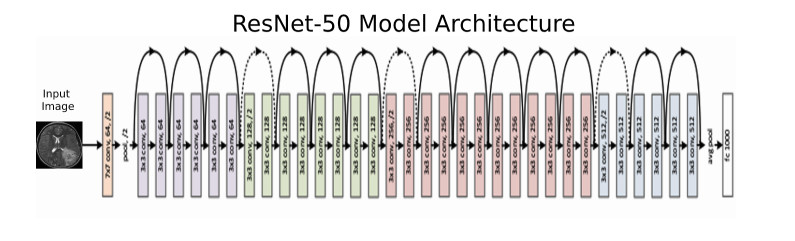

# Implementation of Resnet50 architecture

- [Implementation of Resnet50 architecture](#implementation-of-resnet50-architecture)
  - [Architecure](#architecure)
  - [Training test](#training-test)
  - [Usage](#usage)


</br>

It is based on [Deep Residual Learning for Image Recognition](https://arxiv.org/abs/1512.03385) paper and on what I've learned in [this coursera course](https://www.coursera.org/learn/convolutional-neural-networks?).

## Architecure

</br>

The model is built using this architecture provided in aforementioned paper:
</br>
</br>



</br>

## Training test

I tried to train the model on [patch_camelyon](https://www.tensorflow.org/datasets/catalog/patch_camelyon), results can be found in [this notebook](training_model.ipynb)

However model overfitted the dataset hard. Most likely this architecture is too complex and fits the data too well. This may be countered with intruducing image augmentation or just using smaller model.
Overall, however, this network model learns pretty well. It won ImageNet competition after all.

## Usage
</br>

To use the model you can just import it, compile and fit. Initializer will build architecture auotmatically:

```Python
from net import Resnet50

#...

net = Resnet50()
model.compile(optimizer='adam', loss='categorical_crossentropy', metrics=['accuracy'])
net.fit(X,y)
results = net.evaluate(X_test, y_test)
print(results)

#...

```

